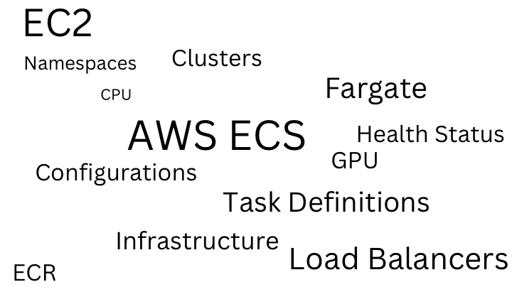
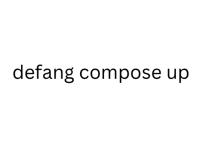

For web developers, it is often tedious and hard to make your web applications available on the internet. For those with limited background expertise and experience like me, deploying your web applications is definitely a pain in the ass. However, Defang emerges as a transformative solution, specifically designed to address and simplify the complexities inherent in deploying web applications. With easy installation and just a simple command in the CLI, Defang does most of the “dirty work” for you quickly and neatly. Let's explore this revolutionary tool, in the context of deploying a simple Restaurant Homepage developed with Django, to underscore the efficiencies and technical advantages it brings to the table.

**Using AWS ECS for Web Deployment**
Deploying a Django application via AWS ECS involves a series of detailed steps: setting up ECS clusters, creating task definitions, configuring services, managing container registries like ECR, and handling load balancers and DNS settings through services like Route 53. This process demands a deep understanding of AWS services and a significant time investment, easily extending into hours or days, especially for developers new to the platform.

For the restaurant homepage application to be specific, you have to set up the configuration to enable autoscaling: if the restaurant owner does not want to spend too much on web services; you will have to set the maximum capacity based on your forecast to the traffic. To name a few other chores you need to consider: you have to manually push your container image, you have to be careful with clusters and task definitions, you might have to make modifications to the settings according certain customer demands, and etc. 

**The Defang Approach**

But with Defang, it is as easy as it looks

Defang radically simplifies this process, reducing what was once a daunting task to a straightforward, 20-minute setup. Here's how:
* __Automated Configuration__:
Defang automates the setup of ECS clusters, task definitions, and service configurations. All of these automation happens behind the scene. 
* __Simplified Container Management__:
It offers an integrated approach to containerization and registry management, streamlining the deployment pipeline from development to production
* __Deployment Efficiency__:
By automating the deployment process, Defang minimizes manual steps, reducing both deployment time and the potential for errors.
* __Scalability and Security__:
It ensures that applications are not only easy to deploy but also scalable and secure, leveraging AWS's robust infrastructure without requiring developers to manage the complexity directly.

**Defang vs. AWS ECS: A Comparative Test with a Django Restaurant Homepage**
Using the deployment of a Django Restaurant homepage as a test case highlights the stark differences between Defang and traditional AWS ECS deployment methods. With AWS ECS, developers need to navigate through a complex setup process, involving multiple AWS services and configurations. In contrast, Defang abstracts these complexities, offering a user-friendly interface that automates much of the process, significantly accelerating deployment time and making cloud deployment accessible to developers with varying levels of expertise.

If this simplicity interests you, you are welcomed to try it out on your local machine.
Github link:[link to sample case](https://github.com/HongchenY/Sample-Restaurant-Homepage)
Defang's Github URL: [Defang](http://github.com.defang-io/defang)

