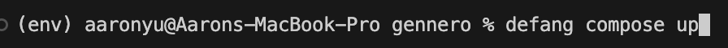

    <em>About the author: Aaron Yu is currently an intern at Defang Software Labs with a keen interest in the area of web development. He wrote this blog post after trying to deploy an application by himself directly on AWS first, and then using Defang.</em>

 

As a student at University of British Columbia, new to the area of web development, I needed to develop and deploy a web application as a course project. It was already a huge challenge to complete the coding part. I could not believe that an even bigger challenge awaited. Picking the right platform and services is tough to start with. Do you know that AWS offers 200 different services? Lucky for me my professors’ instructed us to use ECS. Otherwise, I would have been totally lost.

Starting my project, honestly, it felt like I was hitting a brick wall. Diving into AWS with little to no clue was tough. Terms like "ECS clusters," "task definitions," and "IAM roles" were flying over my head. I was scared of messing something up, especially when it came to setting up things like ECR and load balancers.

It was overwhelming when all these unfamiliar concepts came at me at once. I searched them up on the internet and went straight to a top-rated YouTube tutorial. I spent an hour and a half going through the whole video series. Those tutorials, as helpful as they were, couldn't fully prepare me for the hands-on challenges of real-life implementation. It's one thing to follow along with a guide when everything goes right; it's another to adapt when things don't quite match up to the tutorial’s scenarios.

    

   <em>It could be confusing if you are new to this area</em>

 

I ran into so many problems with configuring services. Sometimes it is caused by carelessly selecting the wrong options; sometimes it is due to the fact that I have no idea what the buttons mean; sometimes it is just a bug with my code. Those errors triple the time it took to deploy my project. It was indeed extremely frustrating.

    

    <em>I have this scary screen when trying to delete the service I created; this is merely one of the many errors I faced</em>

 

Then I found Defang (www.defang.io), and it was like someone flipped a switch. Suddenly, all that complicated stuff became way easier. All I needed to do is to install Defang, build a compose.yaml file to describe my application, and run a single command - defang compose up. And Defang even has a Gen-AI assistant to help you write the code and compose file for your application. Defang automatically does all the heavy-lifting behind the scenes - configuring all the necessary services in a secure and optimal way, and automatically building and deploying my application components. No more late nights trying to figure out AWS docs or stressing about getting everything right. Deploying my Django Restaurant Homepage went from being my biggest worry to one of the smoothest parts of my project.

    

    <em>with just a single command in the CLI</em>

 

With Defang, I could chill a bit and actually enjoy working on my project, focusing on the cool parts without getting bogged down by all the technical stuff. It made cloud deployment feel doable and fun, even for someone like me who was pretty much a beginner. Give it a try yourself - go to www.defang.io to get started.

    

   <em>It is deployed to the internet! (arorschach is my username)</em>

 

Try it yourself!

Sample Case: [Restaurant Homepage](https://github.com/HongchenY/Sample-Restaurant-Homepage)

Defang's Github Page: [Defang](http://github.com.defang-io/defang)
