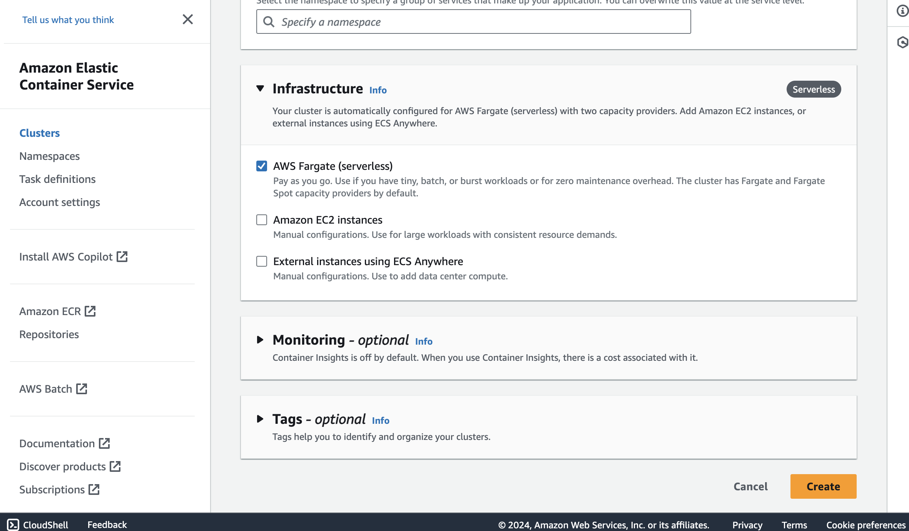
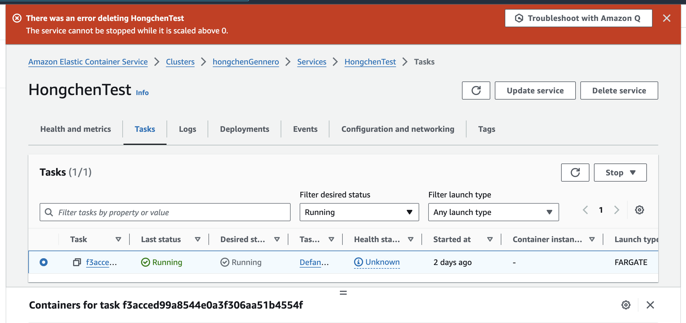
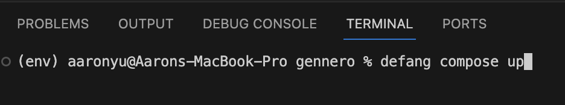
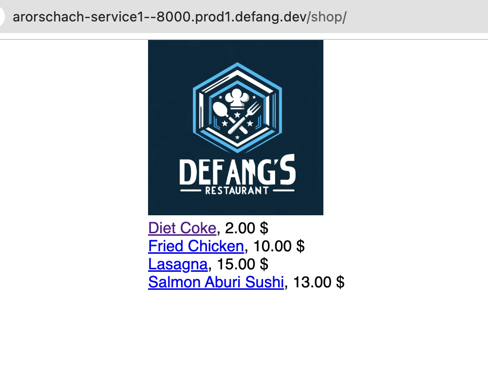

As a student new to the area of web development, I need to develop and deploy a web application as a course project to pass. It was already a huge challenge to complete the coding part. I cannot believe that a bigger challenge awaits. Picking the right platform and service is the tough start. Do you know that AWS offers 200 different services. It is lucky for me to have my professors’ instruction to use ECS. Otherwise, I would be devastated.

Starting my project, honestly, it felt like hitting a brick wall. Diving into AWS with little to no clue was tough. Words like "ECS clusters," "task definitions," and "IAM roles" were flying over my head. I was scared of messing something up, especially when it came to setting things like ECR and load balancers.

It was overwhelming when all these unfamiliar concepts come together. I searched it up on the internet and went straight to a top-rated YouTube tutorial. I spent one hour and half going through the whole video.Those tutorials, as helpful as they were, couldn't fully prepare me for the hands-on challenges of real-life implementation. It's one thing to follow along with a guide when everything goes right; it's another to adapt when things don't quite match up to the tutorial scenarios.

I have run into so many problems with the configuration. Sometimes it is caused by carelessly selecting the wrong options; sometimes it is due to the fact that I have no idea what the buttons mean; sometimes it is just a bug with my code. Those errors triple the time on the deployment process. It is indeed extremely frustrating.

Then I found Defang, and it was like someone flipped the switch. Suddenly, all that complicated stuff became way easier. All I need to do is to install Defang and to run a single command in the CLI. Defang automatically does all the heavy-lifting behind the scene. No more late nights trying to figure out AWS docs or stressing about getting everything right. Deploying my Django Restaurant Homepage went from being my biggest worry to one of the smoothest parts of my project.

With Defang, I could chill a bit and actually enjoy working on my project, focusing on the cool parts without getting bogged down by all the technical stuff. It made cloud deployment feel doable and fun, even for someone like me who was pretty much a beginner. 

Try it yourself!
Github link:[link to sample case](https://github.com/HongchenY/Sample-Restaurant-Homepage)
Defang's Github URL: [Defang](http://github.com.defang-io/defang)

