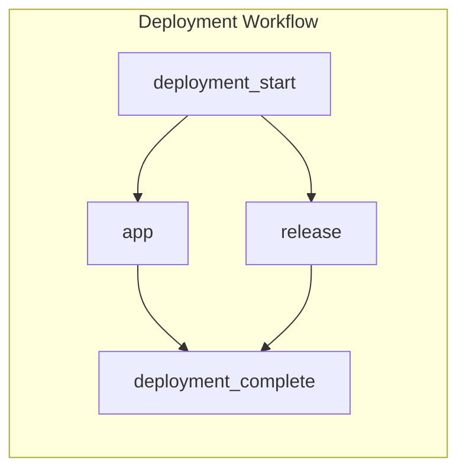
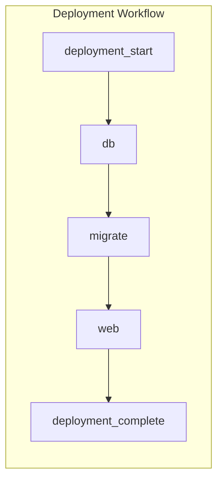

# One-off Jobs
Defang enables you to run one-off jobs during your deployment workflow. One-off jobs are commands that run at specific points in the deployment process, such as after your database is ready but before your application starts.

One-off jobs are run a single time, and failure to run a one-off job will cause the entire deployment to fail.

## When should one-off jobs be used?
One-off jobs are useful for running commands that need to be executed before your application starts. Common use cases include:

- Database migrations
- Warming or cleaning caches
- Running build scripts

## How to configure one-off jobs

One-off jobs can be configured in your `compose.yaml` file as services with a [Restart Policy](https://docs.docker.com/reference/compose-file/services/#restart) set to `"no"`.

In the example below, we define a one-off job called `release` that runs a script called `release.sh`. This job will run once during the deployment process. It will be run concurrently with the `web` service.

<table width="100%">
<thead>
<tr>
<th><code>compose.yaml</code></th>
<th>Workflow</th>
</tr>
</thead>
<tbody>
<tr>
<td valign="top">

```yaml
services:
  app:
    build: .
    ports:
      - "80:80"

  release:
    build: .
    command: ["./release.sh"]
    restart: "no"
```

</td>
<td valign="top">



</td>
</tr>
</tbody>
</table>

### How to specify job dependencies

You can specify when the job should run by using [`depends_on`](https://docs.docker.com/reference/compose-file/services/#depends_on) to define dependencies on other services. For example, when running database migrations, you would typically want to ensure that the database service is ready before executing the migration job.

Here is an example configuration for a one-off job that runs database migrations after the database service is ready:

<table width="100%">
<thead>
<tr>
<th><code>compose.yaml</code></th>
<th>Workflow</th>
</tr>
</thead>
<tbody>
<tr>
<td valign="top">

```yaml
services:
  db:
    image: postgres:latest

  migrate:
    build: .
    command: ["./migrate.sh"]
    depends_on:
      - db
    restart: "no"

  web:
    build: .
    ports:
      - "80:80"
    depends_on:
      - migrate
```

</td>
<td valign="top">



</td>
</tr>
</tbody>
</table>

## How do one-off jobs work under the hood?

One off jobs are deployed as temporary containers on the same infrastructure as your main services. They are deployed as separate containers to ensure that they do not interfere with the main application services, so resources can be configured independently. They will share the same network and security groups as your other services, allowing them to communicate with your application and database services as needed.

### Supported Providers

| Provider       | Release Task Support |
|----------------|:--------------------:|
| Playground     |     ✅ |
| AWS            |     ✅ |
| DigitalOcean   |     ❌ |
| GCP            |     ✅ |


