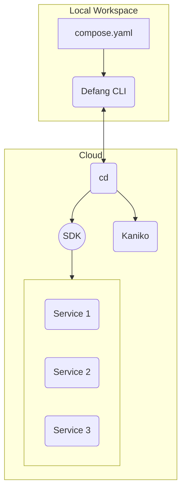

# How Defang Works

Defang is a radically simpler way to develop, deploy, and debug applications in your favourite cloud. Defang abstracts away the complexity of cloud infrastructure and provides a streamlined experience to develop, deploy, and debug your cloud applications.

## Defang CD

The first time you deploy with Defang, we will create a new `cd` service in your cloud account. This service acts as an intermediary between you and your cloud provider. The Defang CLI will communicate with this service to orchestrate the build and deployment process for your services.

:::info
This service does not run all the time. It is only used when you deploy a new service or update an existing service. Once it has finished deploying your service, it will shut itself down.
:::

## Image Builds

When you deploy a new service, Defang will build a Docker image from your source code. `cd` will determine if your service's image needs to be rebuilt, and if it does it will start a new container for each build it needs to complete. Defang uses [Kaniko](https://github.com/GoogleContainerTools/kaniko/actions/workflows/images.yaml) to build your images in a container in your cloud account. The resulting images will be stored in your cloud account's private container registry for future reference. Defang will then deploy this image to your cloud account as a new service.

## Service Provisioning

Once your service's image has been built, Defang will provision cloud resources for your application's services. Defang uses the cloud provider's SDK to create the necessary resources for your services. This includes creating a new container, setting up networking, and configuring any other resources your service needs.
