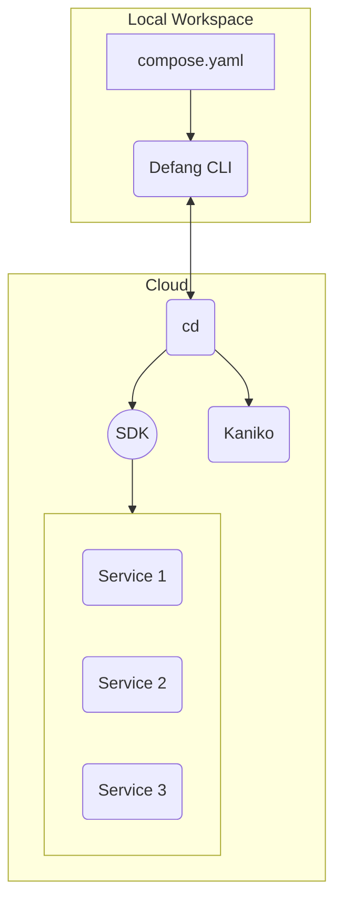

# How Defang Works

Defang is a radically simpler way to develop, deploy, and debug applications in your favourite cloud. Defang abstracts away the complexity of cloud infrastructure, providing you with a streamlined experience. Defang works by provisioning a "cd" service and a small set of resources in your cloud account. These services enable Defang to orchestrate deployments for you in your cloud account from the Defang CLI. Here's how it works.

## Bootstrapping

The first time you deploy with Defang, a new `cd` service will be created in your cloud account. This service acts as an intermediary between you and your cloud provider. It will set up a grpc endpoint with which the Defang CLI can communicate. When the cli sends a request to trigger a deployment, for example, this service will orchestrate the build and deployment process—interfacing with the cloud APIs on your behalf. We will also create the necessary resources to support the defang system. This includes things like roles, a storage space, an image repository, certificates, etc. The specific resources created depend on the cloud provider.

Our architecture and AWS implementation has passed a ["well-architected"](https://docs.aws.amazon.com/wellarchitected/latest/framework/welcome.html) review. We are in the process for obtaining similar qualifications with Digital Ocean and Google Cloud.

You can learn more about the specifics by visiting our [provider docs](/docs/category/providers).

:::info
The `cd` service does not run all the time. It is only used when you deploy a new service or update an existing service. Once it has finished deploying your service, it will shut itself down.
:::

## Orchestrating Deployments

The Defang `cd` service acts as an intermediary between you and your cloud provider. This service receives deployment requests from the Defang CLI. Once a request has been received, `cd` orchestrates the process of building application images from your source code, and then continues to provision the necessary resources to deploy your application.

:::info
The `defang` cli will upload your source code to a storage destination within your cloud. Your source code is never processed by Defang's servers.
:::

## Building Images

When you deploy a new service, Defang will build a Docker image from your source code. This source code is uploaded by the `defang` cli to a storage destination in your cloud account. The Defang `cd` service will then retrieve it and determine if each of your service's images need to be rebuilt. If rebuilding is necessary, `cd` will start a new container for each build it needs to complete.

Defang uses [Kaniko](https://github.com/GoogleContainerTools/kaniko) to build your images in a container in your cloud account. The resulting images will be stored in your cloud account's private container registry for future reference.

## Service Provisioning

After your images have been built, `cd` will provision the necessary resources and deploy these images as new services in your cloud account. Defang uses the cloud provider's SDK to create the necessary resources for your services. This may include creating new containers, setting up networking, and configuring any other resources your services needs, such as storage resources.
